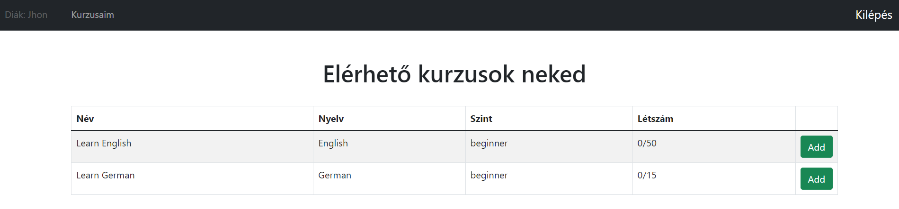

# LanguageCoursesApp
The project was created as a homework for the Server Side Javascript course at  Budapest University of Technology
 
 
The web application has two types of users, an admin who can create, update and delete new language courses and students who can apply for or withdraw from the courses

## Views
### Login

### Registration

## Forgotten pass

### Admin main

### Create course

### Student main

### Student apply

